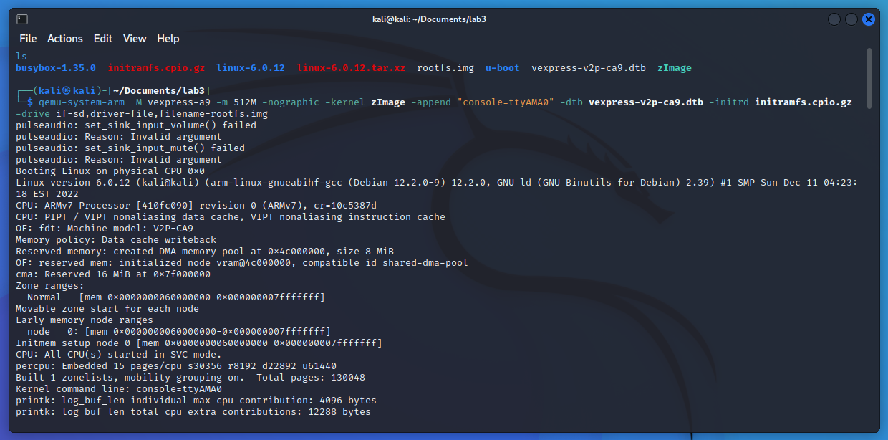
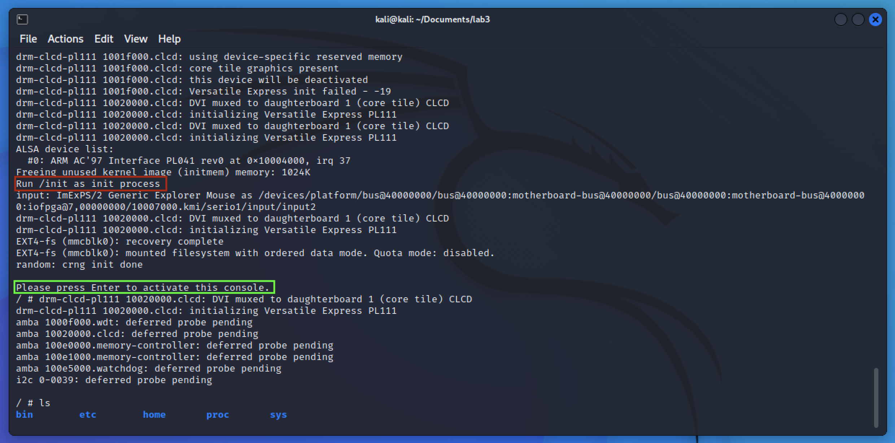
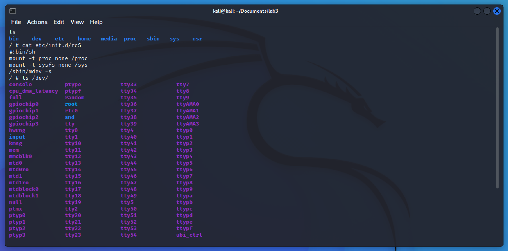
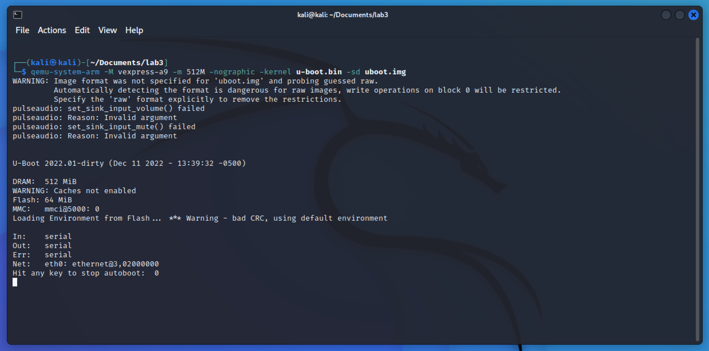
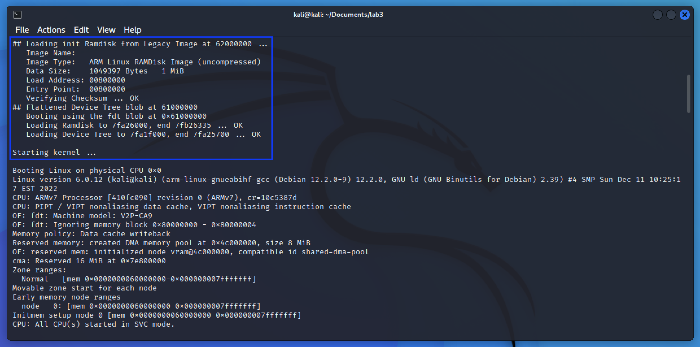
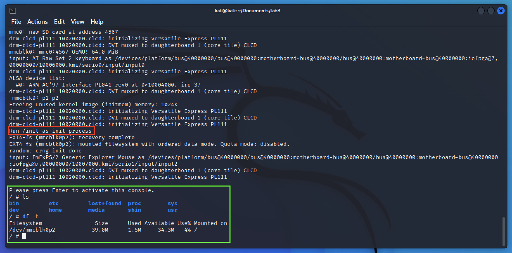

# Install tools [Kali Linux]

```bash
sudo apt-get install g++-arm-linux-gnueabihf
sudo apt-get install bison
sudo apt-get install flex
sudo apt-get install qemu-system-arm
sudo apt-get install bc # yep it's missed on my version of Kali
```

# Build bootloader for ARM arch [u-boot]

```bash
# Download & compile u-boot sources
git clone https://github.com/u-boot/u-boot/
cd u-boot
git checkout v2022.01

export ARCH=arm
export CROSS_COMPILE=arm-linux-gnueabihf-

# edit configs/vexpress_ca9x4_defconfig
# CONFIG_BOOTCOMMAND="load mmc 0:1 0x60008000 zImage;load mmc 0:1 0x61000000 vexpress-v2p-ca9.dtb;load mmc 0:1 0x62000000 initramfs.uimg;setenv bootargs 'console=ttyAMA0';bootz 0x60008000 0x62000000 0x61000000"

make vexpress_ca9x4_defconfig
make

# Copy u-boot image
cp u-boot ../u-boot.bin
cd ../
```

# Prepare initramfs [busybox]

```bash
# Download & compile busybox sources
curl https://www.busybox.net/downloads/busybox-1.35.0.tar.bz2 -o busybox.tar.bz2
tar -xf busybox.tar.bz2
cd busybox-1.35.0

export ARCH=arm
export CROSS_COMPILE=arm-linux-gnueabihf-
make defconfig
make menuconfig

# Enable compile static option in Settings --> Build Options
make install

# Create initramfs structure
cd ..
mkdir initramfs
mkdir -p initramfs/{bin,dev,etc,home,mnt,proc,sys,usr}
cd initramfs

# Create init file
cat <<EOF > init
#!/bin/sh
mount -t proc none /proc
mount -t sysfs none /sys
/sbin/mdev -s

mkdir /mnt/sda
mount /dev/mmcblk0 /mnt/sda

exec switch_root -c /dev/console /mnt/sda /sbin/init
EOF
chmod +x init

# Copy busybox binaries
cp -r ../busybox-1.35.0/_install/* .

# Make initramfs image
find . -print0 | cpio --null -ov --format=newc > ../initramfs.cpio
cd ../
gzip ./initramfs.cpio
```

# Prepare root filesystem [busybox]

```bash
# Create rootfs device & filesystem
qemu-img create rootfs.img 1G
mkfs -t ext4 ./rootfs.img

# Mount rootfs
mkdir rootfs-mnt
sudo mount rootfs.img rootfs-mnt
cd rootfs-mnt

# Create rootfs structure
sudo rm -rf lost+found
sudo mkdir etc proc sys dev etc/init.d usr usr/lib media
sudo mkdir home home/root
sudo cp -r ../busybox-1.35.0/_install/* .
sudo rm linuxrc

sudo touch etc/init.d/rcS
sudo chown $USER etc/init.d/rcS
cat <<EOF > etc/init.d/rcS
#!bin/sh
mount -t proc none /proc
mount -t sysfs none /sys
/sbin/mdev -s
EOF

sudo chmod +x etc/init.d/rcS

# Umount rootfs
cd ..
sudo umount rootfs.img
sudo rm -rf rootfs-mnt
```

# Build latest stable kernel for qemu-arm [6.0.12]

```bash
# Download & compile latest linux kernel
curl https://cdn.kernel.org/pub/linux/kernel/v6.x/linux-6.0.12.tar.xz -o linux-6.0.12.tar.xz
tar -xf linux-6.0.12.tar.xz
cd linux-6.0.12

export ARCH=arm
export CROSS_COMPILE=arm-linux-gnueabihf-

make vexpress_defconfig
make zImage
make modules
make dtbs

# Copy zImage and dtb
cp arch/arm/boot/zImage ../zImage
cp arch/arm/boot/dts/vexpress-v2p-ca9.dtb ../vexpress-v2p-ca9.dtb
cd ../
```

# Boot into rootfs using booting flow: bootloader -> initramfs -> rootfs

```bash
# Boot without using u-boot [initramfs -> rootfs]
qemu-system-arm -M vexpress-a9 -m 512M -nographic -kernel zImage -append "console=ttyAMA0" -dtb vexpress-v2p-ca9.dtb -initrd initramfs.cpio.gz -drive if=sd,driver=file,filename=rootfs.img
```





> Red – executing `/init` on initramfs \
> Green – rootfs loaded using `switch_root`

```bash
# Boot using u-boot

# Prepare a initramfs
cd initramfs

cat <<EOF > init
#!/bin/sh
mount -t proc none /proc
mount -t sysfs none /sys
/sbin/mdev -s

mkdir /mnt/sda
mount /dev/mmcblk0p2 /mnt/sda # second partition of sd

exec switch_root -c /dev/console /mnt/sda /sbin/init
EOF
chmod +x init

find . -print0 | cpio --null -ov --format=newc > ../initramfs.cpio
cd ../
gzip ./initramfs.cpio

./u-boot/tools/mkimage -A arm -C none -O linux -T ramdisk -d initramfs.cpio.gz -a 0x00800000 -e 0x00800000 initramfs.uimg

# Create a bootable SD
dd if=/dev/zero of=uboot.img bs=1M count=64
sgdisk -n 0:0:+16M -c 0:kernel uboot.img
sgdisk -n 0:0:0 -c 0:rootfs uboot.img

sudo losetup -fP uboot.img
sudo mkfs.ext4 /dev/loop0p1
sudo mkfs.ext4 /dev/loop0p2

# Create kernel partition

mkdir kernel-mnt
sudo mount -t ext4 /dev/loop0p1 kernel-mnt/
sudo cp zImage vexpress-v2p-ca9.dtb initramfs.uimg kernel-mnt
sudo umount kernel-mnt
sudo rm -rf kernel-mnt

# Create rootfs partition
mkdir rootfs-mnt
sudo mount rootfs.img rootfs-mnt
mkdir sd-rootfs-mnt
sudo mount -t ext4 /dev/loop0p2 sd-rootfs-mnt/
sudo cp -r rootfs-mnt/* sd-rootfs-mnt
sudo umount rootfs-mnt
sudo umount sd-rootfs-mnt
sudo rm -rf rootfs-mnt sd-rootfs-mnt

sudo losetup -d /dev/loop0

qemu-system-arm -M vexpress-a9 -m 512M -nographic -kernel u-boot.bin -sd uboot.img
```





> Blue – loading and booting kernel
> Red – executing `/init` on initramfs \
> Green – rootfs loaded using `switch_root`
